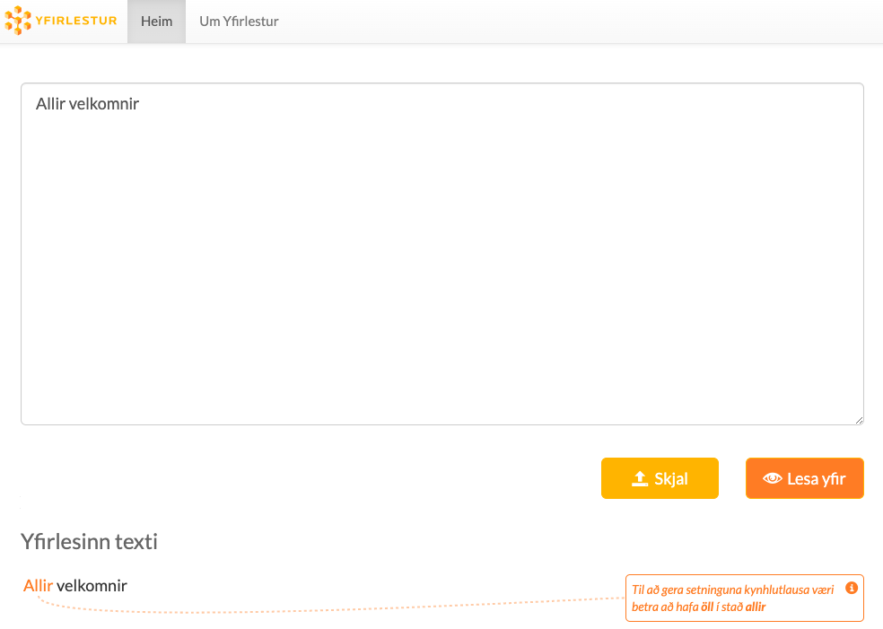

# GreynirCorrect og kynhlutlaust mál

[GreynirCorrect](http://hdl.handle.net/20.500.12537/270) er Python pakki og skipanalínutól frá máltæknifyrirtækinu [Miðeind](https://mideind.is/) sem notað er til að yfirfara íslenska texta. Það byggist á málgreininum [Greyni](http://hdl.handle.net/20.500.12537/269) og getur leiðrétt ýmsar tegundir stafsetningar- og málfræðivillna. 

Á þessari síðu er að finna viðbót við GreynirCorrect fyrir kynhlutlaust mál. Á undanförnum árum hefur ákallið eftir kynhlutlausu máli orðið sífellt háværara en hlutleysishlutverk karlkynsins í íslensku þykir mörgum karllæg og útilokandi málnotkun. Í kynhlutlausu máli í íslensku felst m.a. að notað sé hvorugkyn í stað karlkyns þar sem tíðkast hefur að nota karlkyn til að vísa til fólks óháð kyni.

Umræðan um kynhlutlaust mál hefur þróast mikið á undanförnum árum og tekur enn hröðum breytingum. Þær leiðréttingar sem þessi viðbót GreynirCorrect gerir eru aðeins tillögur og eftir því sem umræðan um kynhlutlaust mál þróast enn frekar verður hægt að gera viðeigandi breytingar og uppfærslur á viðbótinni. 

## Notkun

### Forkröfur

- [Python](https://www.python.org/) >= 3.7 ásamt 'pip'
- [Git](https://github.com/git-guides/install-git)

Sjá frekari upplýsingar [hér](https://yfirlestur.is/doc/installation.html).

### Uppsetning

Til að nota GreynirCorrect með viðbótinni fyrir kynhlutlaust mál (í [Yfirlestur.is](https://yfirlestur.is/) umhverfinu) er hægt að fylgja eftirfarandi skrefum:

Sækja GreynirCorrect
```bash
git clone https://github.com/ingunnjk/GreynirCorrect-GenderNeutral
cd GreynirCorrect-GenderNeutral
# [ Virkja virtualenv hér ef það á við ]
pip install -e .
```
Sækja Yfirlestur
```bash
git clone https://github.com/mideind/Yfirlestur
cd Yfirlestur
pip install -r requirements.txt
python main.py
```
og að lokum opna slóðina http://localhost:5002/.



## Leyfi

Greynir er opinn og frjáls hugbúnaður sem nýta má undir *MIT leyfi*:

   *Permission is hereby granted, free of charge, to any person
   obtaining a copy of this software and associated documentation
   files (the "Software"), to deal in the Software without restriction,
   including without limitation the rights to use, copy, modify, merge,
   publish, distribute, sublicense, and/or sell copies of the Software,
   and to permit persons to whom the Software is furnished to do so,
   subject to the following conditions:*

   *The above copyright notice and this permission notice shall be
   included in all copies or substantial portions of the Software.*

   *THE SOFTWARE IS PROVIDED "AS IS", WITHOUT WARRANTY OF ANY KIND,
   EXPRESS OR IMPLIED, INCLUDING BUT NOT LIMITED TO THE WARRANTIES OF
   MERCHANTABILITY, FITNESS FOR A PARTICULAR PURPOSE AND NONINFRINGEMENT.
   IN NO EVENT SHALL THE AUTHORS OR COPYRIGHT HOLDERS BE LIABLE FOR ANY
   CLAIM, DAMAGES OR OTHER LIABILITY, WHETHER IN AN ACTION OF CONTRACT,
   TORT OR OTHERWISE, ARISING FROM, OUT OF OR IN CONNECTION WITH THE
   SOFTWARE OR THE USE OR OTHER DEALINGS IN THE SOFTWARE.*
